# ICPay Agent Demo

This is an autonomous payment agent example built on the Internet Computer that enables users to pay for AI-powered tasks using ICPay. Users submit requests, receive quotes, make payments, and get AI-generated results seamlessly.

## Overview

This application demonstrates a complete payment-to-execution workflow:


## Architecture

### Frontend (React + TypeScript)
- **React 18** with TypeScript
- **ICPay Widget** for payment processing
- **Vite** for build tooling
- **Tailwind CSS** for styling
- Service layer abstraction for clean code organization

### Backend (Rust Canister)
- **Rust** canister running on Internet Computer
- **ic-llm** for AI/LLM integration (Qwen3_32B model)
- State management using thread-local storage
- Payment tracking and job execution

### Key Services
- [`quoteService.ts`](./src/frontend/src/services/quoteService.ts) - Handles quote generation
- [`icpayService.ts`](./src/frontend/src/services/icpayService.ts) - Manages ICPay integration and payment processing
- [`jobService.ts`](./src/frontend/src/services/jobService.ts) - Handles job execution and payment status

## 🔄 How It Works

### 1. Quote Generation


### 2. Payment Initiation


### 3. Payment Processing


### 4. Job Execution

```mermaid
sequenceDiagram
    participant F as Frontend
    participant B as Backend Canister
    participant L as LLM Canister

    F->>B: execute_job(job_id)
    Note over B: Verify payment status<br/>Check: Status = Completed
    B->>B: Retrieve job request
    Note over B: Get original request<br/>from job storage
    B->>L: Process with LLM (Qwen3_32B)
    Note over L: Generate AI response<br/>Process user request
    L->>B: Return output
    Note over B: Store result<br/>with job_id and timestamp
    B->>F: Return job result
    Note over F: Result contains:<br/>• job_id<br/>• output<br/>• completed_at
```



### 5. Result Display

```mermaid
sequenceDiagram
    participant F as Frontend
    participant U as User

    Note over F: Job result received
    F->>F: Update state to "completed"
    Note over F: Format result data:<br/>• Job output<br/>• Transaction ID<br/>• Completion time
    F->>U: Display result card
    Note over U: User sees:<br/>• LLM-generated output<br/>• Payment transaction ID<br/>• Job completion timestamp
    U->>F: Option to start new request
```



## 📁 Project Structure

```
icpay-agent/
├── src/
│   ├── backend/              # Rust canister
│   │   ├── src/
│   │   │   └── lib.rs        # Main canister logic
│   │   ├── backend.did      # Candid interface
│   │   └── Cargo.toml       # Rust dependencies
│   │
│   └── frontend/             # React frontend
│       ├── src/
│       │   ├── pages/
│       │   │   └── PaymentAgent.tsx  # Main payment UI
│       │   ├── services/
│       │   │   ├── quoteService.ts    # Quote API calls
│       │   │   ├── icpayService.ts   # ICPay integration
│       │   │   └── jobService.ts     # Job execution
│       │   ├── types/
│       │   │   ├── payment.ts        # Payment types
│       │   │   └── quote.ts         # Quote types
│       │   └── components/          # UI components
│       ├── package.json
│       └── vite.config.js
│
├── dfx.json                  # IC project configuration
├── package.json              # Workspace root
└── README.md
```

## Setup Instructions

### 1. Install Dependencies

```bash
# Install root dependencies
npm install

# Install frontend dependencies
cd src/frontend
npm install
cd ../..
```

### 2. Configure Environment Variables

Create a `.env` file in the project root:

```bash
# ICPay Configuration
# Get your publishable key from https://icpay.org/settings
PUBLIC_KEY=pk_key_here
```

### 3. Get Your ICPay Public Key

1. Sign up or log in at [https://icpay.org](https://.icpay.org)
2. Navigate to your API keys section
3. Copy your publishable key (starts with `pk_`)
4. Add it to your `.env` file as `PUBLIC_KEY`

### 4. Start Development

```bash
# Terminal 1: Start IC replica
dfx start --clean --background 

# Terminal 2: Build and deploy canisters
dfx deploy

# Terminal 3: Start frontend dev server
cd src/frontend
npm run dev
```

The application will be available at `http://localhost:5173`

## 💳 How ICPay Integration Works

This section explains how the ICPay payment widget is integrated into the application, from initialization to successful payment processing.

### 1. Publishable Key Validation

The first step is validating and retrieving the ICPay publishable key from environment variables. This happens in [`icpayService.ts`](./src/frontend/src/services/icpayService.ts):

```typescript
export const getPublishableKey = (): string | null => {
  const publishableKey = import.meta.env.PUBLIC_KEY || '';

  if (!publishableKey || publishableKey.trim() === '') {
    console.error('ICPay publishable key is missing...');
    return null;
  }
  
  // Check if user accidentally used a secret key instead of publishable key
  if (publishableKey.startsWith('sk_')) {
    console.error('ERROR: You are using a SECRET KEY (sk_) instead of a PUBLISHABLE KEY (pk_)...');
    return null;
  }
  
  return publishableKey;
};
```

**Key Points:**
- Reads from `PUBLIC_KEY` environment variable
- Validates the key format (must start with `pk_`)
- Prevents accidental use of secret keys (`sk_`) in frontend code
- Returns `null` if validation fails

### 2. Creating ICPay Configuration

Once a quote is received, the ICPay configuration object is created. This configuration is memoized to prevent unnecessary re-renders:

```typescript
// In PaymentAgent.tsx
const icpayConfig = useMemo(() => {
  return createICPayConfig(quote, userRequest);
}, [quote, userRequest]);
```

The `createICPayConfig` function in `icpayService.ts`:

```typescript
export const createICPayConfig = (
  quote: Quote | null,
  userRequest: string
): ICPayConfig | null => {
  if (!quote) return null;
  
  const publishableKey = getPublishableKey();
  if (!publishableKey) return null;

  return {
    publishableKey,
    amountUsd: quote.price,
    defaultSymbol: quote.currency === "ICP" ? "ICP" : "ICP",
    showLedgerDropdown: 'dropdown',
    progressBar: { enabled: true, mode: 'modal' },
    metadata: {
      job_id: quote.job_id,
      request: userRequest,
    },
  };
};
```

**Configuration Properties:**
- `publishableKey`: The validated publishable key
- `amountUsd`: The quote price in USD
- `defaultSymbol`: Default cryptocurrency (ICP)
- `showLedgerDropdown`: Shows ledger selector dropdown
- `progressBar`: Enables modal progress bar during payment
- `metadata`: Custom metadata including `job_id` and user request

### 3. Rendering the ICPay Widget

The [ICPay Pay Button widget](https://docs.icpay.org/widget/components/pay-button) is conditionally rendered when a quote is available and the configuration is valid:

```typescript
// In PaymentAgent.tsx
{state === "quoted" && (
  <div className="flex-1">
    {icpayConfig ? (
      <IcpayPayButton
        config={icpayConfig}
        onSuccess={handlePaymentSuccess}
        onError={handlePaymentError}
      />
    ) : (
      <div className="p-4 bg-yellow-500/10 border border-yellow-500/30 rounded-lg">
        <p>Configuration Error</p>
        <p>ICPay publishable key is missing...</p>
      </div>
    )}
  </div>
)}
```

**What Happens:**
1. Widget only renders when `state === "quoted"` and `icpayConfig` is valid
2. If configuration is invalid, shows an error message instead
3. Widget displays a payment button with the quote amount
4. User can select their wallet and proceed with payment

### 4. Payment Success Handling

When payment succeeds, the ICPay widget calls the `onSuccess` callback with payment details:

```typescript
// In PaymentAgent.tsx
const handlePaymentSuccess = async (detail: any): Promise<void> => {
  try {
    // Extract transaction ID from payment detail
    const result = icpayHandlePaymentSuccess(detail);
    setPaymentResult(result);
    setState("waiting_for_payment");
    setError(null);
    
    // Complete payment in backend
    if (!quote) {
      setError("Quote not found. Cannot complete payment.");
      setState("error");
      return;
    }
    
    await completePayment(String(quote.job_id), result.transactionId);
    
    // Execute the job
    setState("executing");
    const jobResult = await executeJob(quote.job_id);
    
    setJobResult(jobResult);
    setState("completed");
    setError(null);
  } catch (err) {
    console.error("Error in payment success flow:", err);
    setError(err instanceof Error ? err.message : "Failed to complete payment...");
    setState("error");
  }
};
```

The `handlePaymentSuccess` function in `icpayService.ts` extracts the transaction ID:

```typescript
export const handlePaymentSuccess = (detail: IcpaySuccess | any): PaymentResult => {
  console.log("Handling payment success...");
  console.log("detail", detail);
  
  // Extract transaction ID - convert to string if it's a number
  const transactionId = detail?.tx?.transactionId || detail?.id || '';
  
  console.log("Extracted transaction ID:", transactionId);
  
  return {
    transactionId: String(transactionId),
    success: true,
  };
};
```

**Payment Detail Structure:**
The `detail` object from ICPay contains:
```typescript
{
  transactionId: "4ec33256-0e84-498e-b003-881e1457927e",  // Primary transaction ID
  tx: 359,  // Numeric transaction reference
  payment: {
    transactionId: "4ec33256-0e84-498e-b003-881e1457927e",
    id: "3b8b9a3c-7a7a-4916-a7ef-87e154ff72ee",
    // ... other payment details
  },
  paymentIntent: {
    id: "e79ee368-0d7d-4a6d-b347-969d2b7e451d",
    // ... payment intent details
  },
  // ... other fields
}
```

**Success Flow:**
1. Extract transaction ID from payment detail
2. Convert to string (handles both string and number formats)
3. Update UI state to "waiting_for_payment"
4. Call `completePayment()` to update backend payment status
5. Change state to "executing"
6. Call `executeJob()` to process the job
7. Update state to "completed" and display result

### 5. Payment Error Handling

If payment fails, the `onError` callback is triggered:

```typescript
// In PaymentAgent.tsx
const handlePaymentError = (error: unknown): void => {
  const errorMessage = icpayHandlePaymentError(error);
  setError(errorMessage);
  setState("error");
};
```

The `handlePaymentError` function provides user-friendly error messages:

```typescript
export const handlePaymentError = (error: unknown): string => {
  console.error("Payment error:", error);
  
  let errorMessage = 'Payment failed. Please try again.';
  
  if (error && typeof error === 'object' && 'message' in error) {
    const msg = (error as { message: string }).message;
    
    // Provide user-friendly error messages
    if (msg.includes('Failed to fetch verified ledgers') || msg.includes('401')) {
      errorMessage = 'ICPay authentication failed. Please check your publishable key...';
    } else if (msg.includes('CORS') || msg.includes('Failed to fetch')) {
      errorMessage = 'Network error. Please ensure your Internet Computer replica is running...';
    } else {
      errorMessage = msg;
    }
  }
  
  return errorMessage;
};
```

**Error Types Handled:**
- **401 Unauthorized**: Invalid or missing publishable key
- **CORS Errors**: Network connectivity issues
- **Generic Errors**: Fallback to original error message

### Complete Flow Summary


### Key Integration Points

1. **Environment Variable**: `PUBLIC_KEY` must be set
2. **Widget Component**: `IcpayPayButton` from `@ic-pay/icpay-widget/react`
3. **Callbacks**: `onSuccess` and `onError` handle payment outcomes
4. **State Management**: React state controls widget rendering and payment flow
5. **Backend Integration**: Transaction ID is used to complete payment in backend